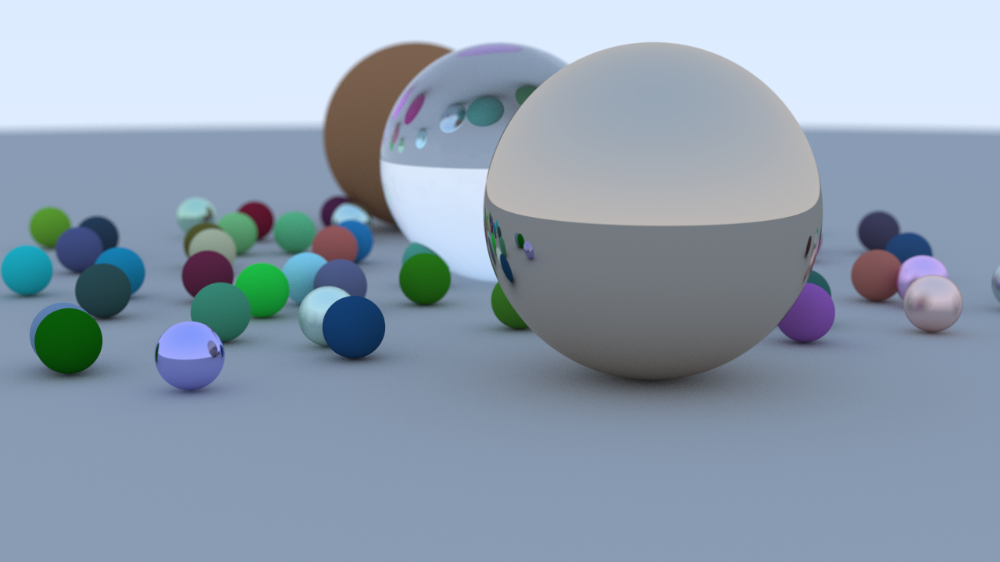

# Ray Tracer

A C++ ray tracer implementation following the "Ray Tracing in One Weekend" guide.



## Features

- Multi-threaded rendering with configurable thread count
- Multiple output formats: PNG, PPM, BMP, JPEG
- Materials: Lambertian (diffuse), Metal, Dielectric (glass)
- Defocus blur (depth of field)
- Gamma correction
- Progress display with elapsed time

## Dependencies

None - uses only the C++ standard library and the included stb_image_write.h

## Build

Compile all source files with C++17 or later:

```bash
g++ -std=c++17 -O3 main.cpp -o raytracer
```

or

```bash
mkdir build && cd build
cmake ..
cmake --build . --config Release
```

## Usage

```bash
./raytracer [options]
```

Options:
- `-ppm` - Save as PPM
- `-png` - Save as PNG (default)
- `-bmp` - Save as BMP
- `-jpg` - Save as JPEG

## Configuration

Edit `main.cpp` to adjust render settings:

| Parameter | Default | Description |
|-----------|---------|-------------|
| `image_width` | 1280 | Output width in pixels |
| `samples_per_pixel` | 500 | Anti-aliasing samples |
| `max_depth` | 25 | Maximum ray bounces |
| `max_threads` | 8 | Thread count (0 = auto) |

## Output

Rendered images are saved to the `output/` directory.

## Scene

The default scene contains:
- Large ground plane
- Random field of small spheres (diffuse, metal, dielectric)
- Three large spheres (glass, diffuse, metal)

## Acknowledgements

- [Ray Tracing in One Weekend](https://raytracing.github.io/books/RayTracingInOneWeekend.html) by Peter Shirley - the guide this project is based on
- [stb_image_write.h](https://github.com/nothings/stb) by Sean Barrett - public domain image writing library